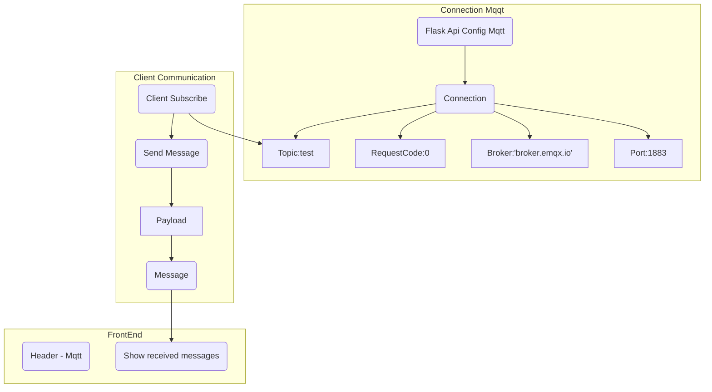
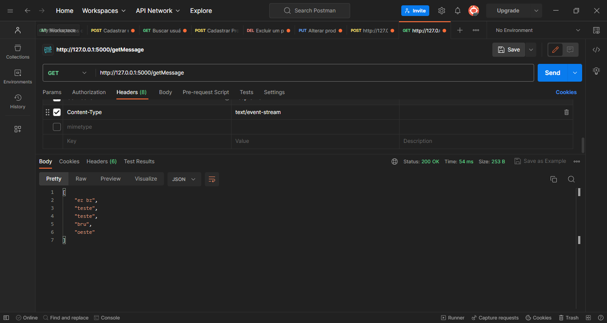
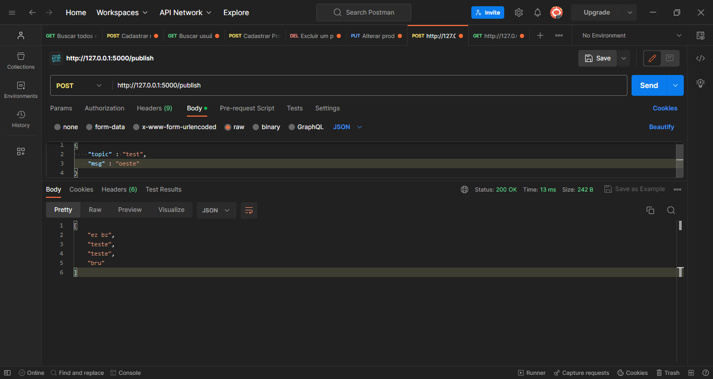
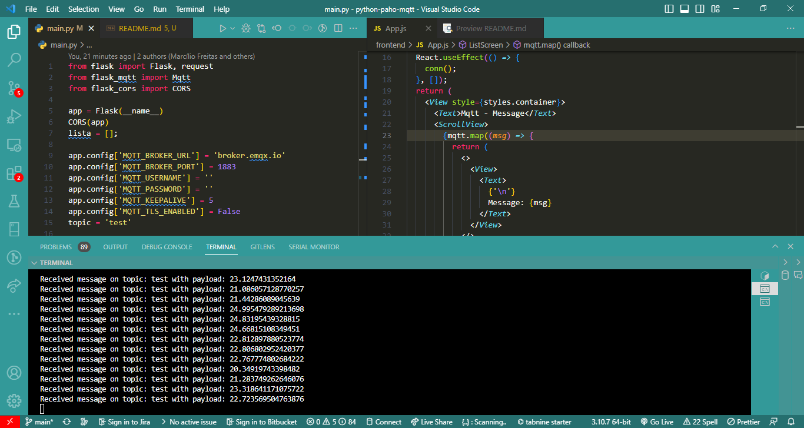
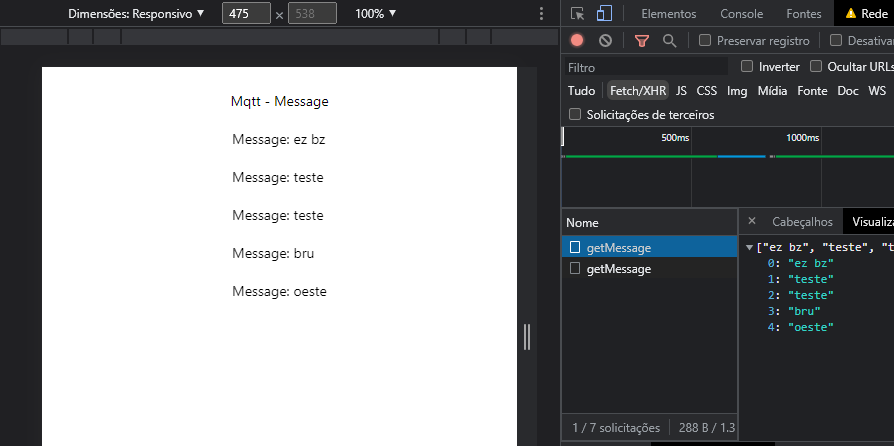

# Atividade - Aplicação com Mqtt

***

### Sobre a aplicação

- O Flask dispõe de uma biblioteca chamada **flask_mqtt**
para criar uma comunicação com o protocolo MQTT. Nossa 
API foi criada a partir dessa, estabelecendo uma conexão via 
método **@mqtt_client.on_connect()** e exibindo as mensagens via
**@mqtt_client.on_message()**.

- Como extra, exibimos as mensagens recebidas na tela da aplicação
com **Javascript** e **React Native**, na qual puxava os dados
com o método **getMessage**. 

- Além de públicar as mensagens através da inscrição em um tópico
do broker escolhido, criamos um método **publish** para públicar
da nossa aplicação para as demais que estavam conectadas.

***
### Gráfico

- Abaixo um pequeno esquema de como funciona a configuração básica do Mqtt na nossa aplicação.

***
### Imagens

- Abaixo algumas imagens dos resultados obtidos

***

- Capturando as mensagens 

- Publicação com a API

- Desconhecidos conectados ao tópico e broker atuais

- Frontend
